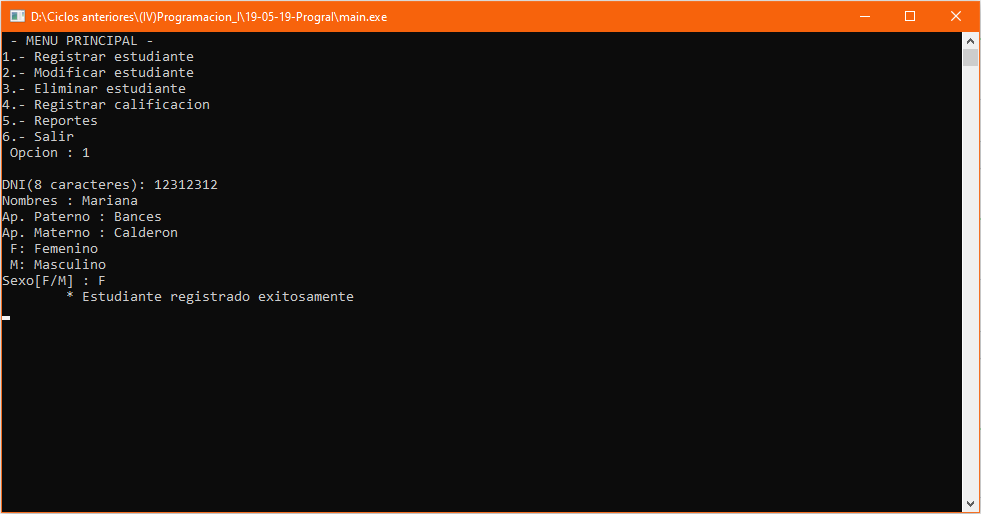
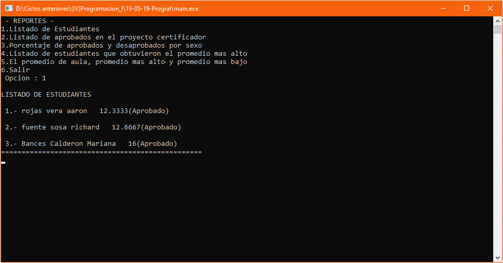

# Control de estudiantes
Sistema de control de estudiantes que permite ingresar los datos de un estudiante, modificar estudiante, eliminar estudiante, registrar las calificaciones de los estudiantes; en los reportes tenemos un listado de los estudiantes, listado de aprobados en el proyecto certificador, porcentaje de aprobados y desaprobador por género, listado de estudiantes que obtuvieron el promedio más alto y  el promedio del aula, el promedio más alto y más bajo, **19/05/19**.

<strong>Imagen:</strong> Menú principal.

<strong>Imagen:</strong> Menú de reportes.

